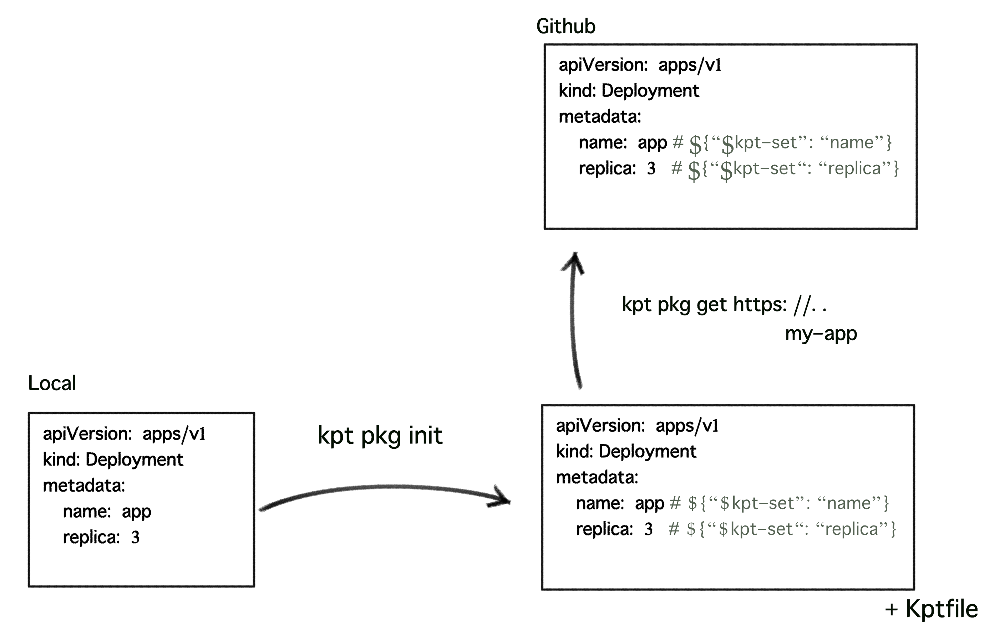
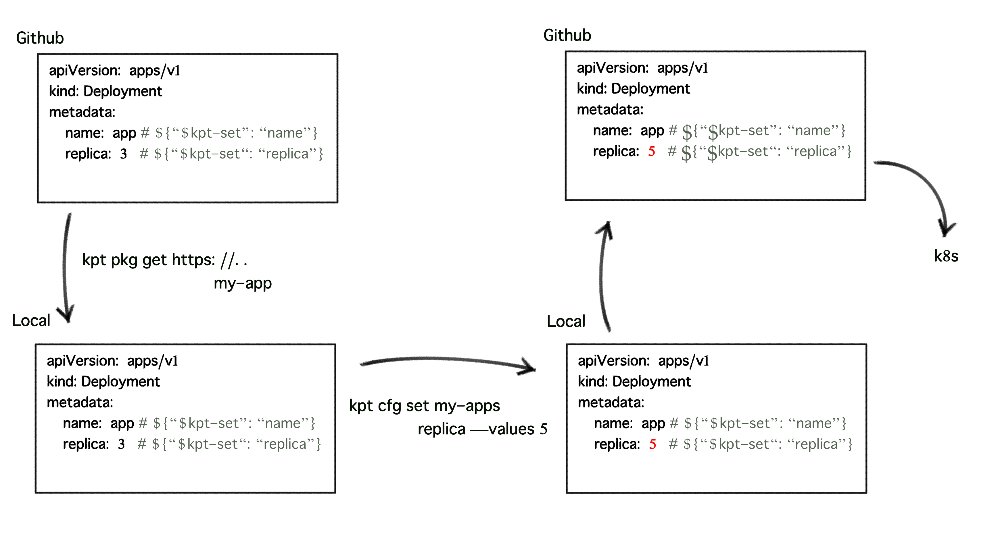

# KPT

ABEMAでアドテクチームに所属しているshiv3です。

以前より、私達のチームではKubernetes上でマイクロサービスの開発・運用を行っています。Kubernetes上のリソースの構成は主にyamlで書かれていますが、そのyamlの管理をどうするかという話題が定期的に上がっておりました。

数ヶ月ほど前より私達のチームでは、新規開発されるサービス及び新しく作成したKubernetesクラスタのmanifest管理のためにkptというツールを使い始めました。

kptを使用することで利点もありましたが、いくつか大変だったこともあり、今回はそのkptについて紹介します。

## 以前までの構成管理

kptの話の前に、以前までのmanifestの管理について紹介します。

以前まで私達のチームでは、k8sクラスタに上げるための構成は以下のようなシンプルな方法でyamlの管理を行っていました。(部分的にhelmを利用しています

- 構成管理を行うために二種類のファイルを用意
    - Jinja2のテンプレートで書かれたdeploymentやserviceなどの構成ファイル(xxx_deployment.template.yaml)
    - 各環境ごと(prd/stg/dev/load)の設定情報を記述した設定ファイル(dev_var.yaml)
- 上記のファイルをpythonのスクリプトで結合・テンプレートの反映をさせて対象環境ごとのyamlを生成

上記の方法はhelmやkustomizeのような知識がなくとも誰でもカジュアルに使え、helm側のバージョン管理などを意識せずに使えたため便利ではあり、3年ほどこちらの方法で運用を行っていましたが、以下のような課題がありました。

- テンプレート側のディレクトリ構成やファイル名のプレフィックスなどが煩雑になっていた
	- ディレクトリごとにenvファイルがあるため、そのファイルの設定記述が肥大化していた
	- CIでtemplateの展開を行うようにしていたが、CIの実行時間がファイル数に対し線形的に増加していた
	- マイクロサービスのコードとmanifestを管理されている部分の場所が離れている
	- どのコンポーネントがどのmanifestファイルでデプロイされているのかが分かりづらかった
	- コードの修正に伴う構成変更などが少し煩雑になりがちだった

もちろん、こちらの方法でのメリットも多かったのですが、新しくサービスを作るにあたって別の管理方法を試そうと思っていました。

## manifest管理ツール

kubernetesの構成管理ツールとしてはhelmやkustomizeなどが有名だと思いますが、新しく構成管理ツールとして検討していた当時はChartを構成するためのファイル構成が必要になったり、kustomizationの仕様が少し複雑になる可能性があるのではないかという懸念がありました。

その際に後述のkptというツールの存在を知り、kubernetesの素の構成ファイルをそのままテンプレートとして使えるという機能に魅力を感じ使用を検討しました。

## KPT

[kpt](https://googlecontainertools.github.io/kpt/) 

Googleのオープンソースツールであるkptは、 [Kubernetes Resource Model(KRM)](https://github.com/kubernetes/community/blob/master/contributors/design-proposals/architecture/resource-management.md)の構成を管理するための軽量なツールで、gitとyamlを組み合わせる形で利用を行い、構成をコード(template/DSL)としてではなくデータ(API)としてパッケージ化を行うというモデルを採用しています。

執筆時点でのバージョンは `v0.39` ですが、近々 `v1.0.0` のリリースも予定されています。

kptには以下のような特徴があります

- データとしての構成管理
    - 構成をコード(テンプレート/DSL)ではなく、静的なデータ(API)としてパッケージ化をします。
    - ChefやTerraformのようなツールでは構成管理を順次実行可能なコードやDSLとして管理を行いますが、kptではほぼプレーンな状態のk8sのmanifestのyamlとして構成を管理を行います。
    - また、kptで使用される構成は、スキーマとセマンティクスが定義されているKubernetes Resource Model（KRM）に準拠している必要があり、KRMにはk8sの構成だけでなくGCPのリソースなど、Kubernetes 以外のリソースも管理することが出来ます。

- Shift-left & GitOps
    - kptではGitOpsを採用しています。
    - クラスターへの変更はgitを用いてreviewed, approved, validated, audited and rolled backが行われます。
    - また、Gitの自動化をクラスタへの状態変更に使うことが出来ます。

- Composability
    - 各コマンドの出力が別のコマンドの入力として読み取られることを期待して連携するような設計
        - コマンドはmanifestの読み取りと書き込みを行う
        - 入力と出力は対象である
        - kptコマンドを一緒にパイプすることが可能
        - kptコマンドの出力をそのソースに書き戻すことも可能
- リソース指向
    - システムの状態は、Kubernetesのリソースをそのまま使用して表現されます。
    - 高レベルのロジックはmanifestを読み込み、何らかのコンテキストでmanifestを生成出来ます。
- スキーマ駆動
    - タイプまたはオブジェクト固有のロジックをツールに組み込めません。
- レイヤリング
    - 固有の複雑さを軽減し、ケースを単純化するために高レベルのレイヤーが存在できます。

Kptは上記の方針による構成管理をPackageとSetterでの設定管理で実現しています。

## Package

kptではKptfileというファイルが存在するディレクトリをpackageとして扱います。
packageという単位はHelmのChartのようなものですが、gitでの管理のされ方はgoのパッケージ管理のようなものに近いかもしれません。

packageはmanifestがあるディレクトリにKptfileというファイルを作成することで管理されます。また、パッケージを取得すると配布側のパッケージの情報がKptfileに追記されて取得されます。

## Config

kptでは各manifestのyamlごとにテンプレートとして設定を変更する項目を、Key/Valueペアのsetterとして作成します。
setterを作成すると設定する箇所のKey/Valueペアの情報がKptfileに追記され、manifestのyamlの該当箇所にsetterとしてのコメントを記載しておくことでテンプレートとして変更可能となります。

## 使い方

チュートリアルについては[Google Cloudのドキュメント](https://cloud.google.com/architecture/managing-cloud-infrastructure-using-kpt?hl=ja)が良いかと思われます。

またここでは、 `v0.39` から `v1.0` への変更による差分が少ない pkg / cfg の簡易的な使い方の説明を行います。

kptには以下のようなコマンド体系が存在します

- kpt pkg
	- kptパッケージを扱うためのコマンド。また、gitを使用してパッケージを取得・更新するためのコマンド
- kpt cfg
	- Setterを使用してkptの設定値を設定、更新するためのコマンド
- kpt live 
	- kptパッケージをKubernetesクラスタにデプロイするためのコマンドです
	- 以前はInventory templateというConfig Mapで管理されていましたが、 `v1.0`より `ResourceGroup` CRDで管理されるように変更されました
- kpt fn 
	- ローカルのkptパッケージ( KRM ) に対して操作を行える仕組み、及びそれを実行するためのコマンドです
	- `v1.0` より `run render` / `run eval` に分割されました

構成管理として簡易的に用いる場合は主に `kpt pkg` 及び `kpt cfg` のサブコマンドを用います。

### Publisher側



まず、packageの作成者は該当のpackageで `kpt pkg init` を実行し、packageを初期化します。Kptfileが作成され、packageの設定が記述されます。

#### configの設定

以下のようなDeploymentのyamlファイルをテンプレートを用い、replica数を変更出来るようにしたい場合、

```
kind: Deployment
metadata:
  name: foo
spec:
  replicas: 3
```

```
kpt cfg create-setter . replicas 3
```

のように実行することで、Kptfileとyamlの対象のkeyにsetterが作成されます。
こちらの値は、Consumer側がこのkptパッケージを使用する際のデフォルトの値となります。

```
kind: Deployment
metadata:
  name: foo
spec:
  replicas: 3 # {"$kpt-set":"replicas"}
``` 

こちらの設定されたファイル、及び作成されたKptfileをGithubなどのGitリポジトリにpushすることでパッケージの公開が完了します。

### Consumer側



- パッケージを使う側では、 `kpt pkg get REPO_URI[.git]/PKG_PATH[@VERSION] my-app`  を実行し上記で作成されたpackageを取得します。

#### Configの設定

- `kpt cfg set my-app replicas --values 5` を実行し、既に設定されていたreplica数の設定値を5に変更します。
- あとはGitにpushしてGitopsなどでリリースを行うか、 `kpt live` コマンドを用いてリリースを行うことが出来ます。

## 使用感

良かった点、悪かった点としては以下のような形でした。

- cliのコマンドベースで構成を管理するツールとしては簡易的で良さそうだと思いました。
- 階層化された値を編集したり、configmapの中身を編集したりするのが難しいため、複雑な構成を管理するには難易度が高い
- `kpt pkg update` コマンドを実行するたびに対象のリポジトリをcloneするため、モノレポなどと相性が悪い
- 開発中なので、v1.0安定版が出るまでは細かい機能については少し様子見が必要かもしれません。

## 今後

今回はkptでKubernetesのDeploymentの構成管理をするための本当に簡易的な使い方の説明でしたが、今後リリースを予定されているv1.0で大きく変わるliveやfunctionなどではKRMを管理する上での利点があるため、機会があれば紹介したいと思っています。

また、kptを開発しているGCPは今後KRMのよるリソースの管理をKubernetesリソースだけではなくあらゆるGCPのリソースで可能にしていきたいという方針があるようで、既にConfig Connectorなどを使用してKubernetesクラスタ内からMemoryStoreなどのリソースを作成することが可能となっています。

https://cloud.google.com/blog/ja/products/containers-kubernetes/understanding-configuration-as-data-in-kubernetes

執筆時点の現在はまだ開発中のツールですが、kptがKRMリソースの管理を行うツールの選択肢として候補に上げてみてはいかがでしょうか。気になった方はぜひ試して見てください。